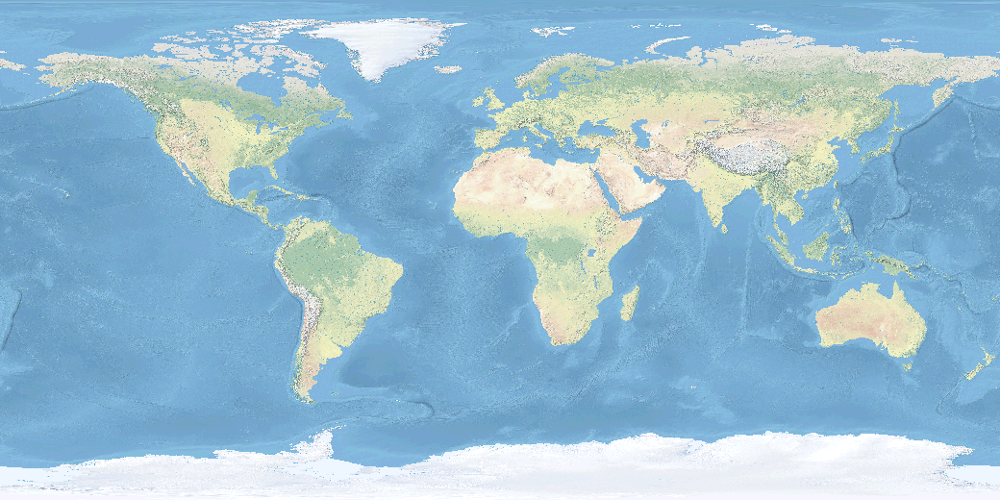

# Natural Earth Dataset for GRASS GIS in WGS 84
This geospatial dataset contains
global raster and vector data.
The top level directory *natural-earth-dataset* is a GRASS GIS location
for World Geodetic System 1984 (WGS84) with
[EPSG code 4326](https://epsg.io/4326).
Inside the location there is the *PERMANENT* mapset,
a license file, and readme file.
For a larger, more complete global dataset,
see https://doi.org/10.5281/zenodo.3359632.

## Instructions
Install [GRASS GIS](https://grass.osgeo.org/),
unzip this archive, and move the location
into your [GRASS GIS database](https://grass.osgeo.org/grass77/manuals/grass_database.html)
directory.
If you are new to GRASS GIS read the
[first time users guide](https://grass.osgeo.org/documentation/first-time-users/).

## Data Source
* [Natural Earth](https://www.naturalearthdata.com/)

## License
This dataset is licensed under the
[ODC Public Domain Dedication and License 1.0 (PDDL)](https://opendatacommons.org/licenses/pddl/index.html)
by Brendan Harmon.
